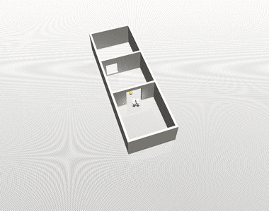
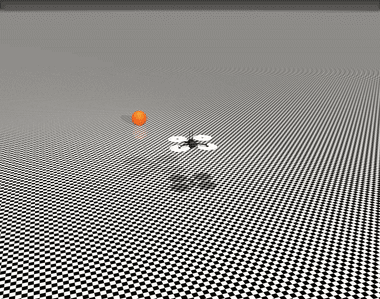
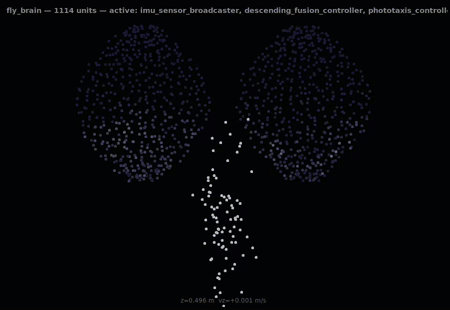

# fly_robot_control

A bio-inspired "fly brain," loosely modeled on *Drosophila melanogaster*'s
flight-control circuitry (halteres for fast gyroscopic reflexes, optic-flow
motion detectors for visual stabilization, and phototaxis for vision-guided
navigation), controlling a simulated quadrotor drone in MuJoCo, wired up
through real ROS2 `ros2_control` chainable controllers.

This is **not** the real FlyWire/hemibrain connectome (~140,000 neurons). It's
a small, hand-designed network (a few control loops, ~1,100 simulated
"vision" units) inspired by the *structure* of the fly's flight-control
circuitry, not a literal reconstruction of the brain.

## See it fly

**Vision-guided navigation through a 3-room house** (door + elevated window,
real wall occlusion, `m7_house_flight.launch.py`):



**Continuous chase behavior**: the drone keeps re-acquiring and pursuing a
target that relocates every time it gets close (`m6_moving_target.launch.py`):



**Live "neuron cloud" activity monitor**: every point is a real published
signal (Reichardt-EMD vision units + the haltere/fusion reflex core), not a
mock-up (`ros2 run fly_simulation brain_activity_monitor.py`):



## Architecture

Three ROS2 packages, one MuJoCo drone model:

```
                    ┌──────────────────────┐
   camera ────────► │ optic_flow_controller │──┐
                    └──────────────────────┘  │ (yaw_rate, roll_drift,
                                               │  forward_drift, vertical_drift)
   camera ────────► ┌──────────────────────┐  │
   (color blob)     │ phototaxis_controller │──┤ (turn-toward / approach)
                    └──────────────────────┘  │
                                               ▼
   IMU (gyro+accel) ──────────────────► ┌──────────────────────────┐
                                        │ haltere_reflex_controller │──► thrust1-4
                                        └──────────────────────────┘   (effort)
                                               ▲
   /drone/free_joint_states ──────►  ┌────────────────────────────┐
       (altitude)                    │ descending_fusion_controller│
                                      └────────────────────────────┘
```

All controllers are real `controller_interface::ChainableControllerInterface`
plugins, not simulated message-passing. `fly_controller::BaselinePidController`
(a conventional cascaded PID, no bio-inspired parts) is the standing
comparison baseline used throughout development.

| Package | Contents |
|---|---|
| `fly_brain` | The bio-inspired algorithm library (`include/fly_brain/*.hpp`: mixer, complementary filter, haltere reflex law, Reichardt EMD + LPTC pooling, color-blob phototaxis, descending fusion) plus the `HaltereReflexController`, `OpticFlowController`, `PhototaxisController`, `DescendingFusionController` plugins that wrap it into `ros2_control`. |
| `fly_controller` | `ros2_control` integration: the drone's URDF/xacro, `controller_manager` configs, the vendored MuJoCo `skydio_x2` model plus this project's own scene variants (open field, moving-target arena, 3-room house), and `BaselinePidController` (the comparison baseline). |
| `fly_simulation` | Bring-up launch files (one per milestone) and two live tools: `brain_activity_monitor.py` (the neuron-cloud GUI above) and `moving_target.py`/`house_navigator.py` (environment orchestration: teleporting targets, sequencing waypoints). |

Physics/rendering: [MuJoCo](https://mujoco.org/) via
[`ros-controls/mujoco_ros2_control`](https://github.com/ros-controls/mujoco_ros2_control),
running on ROS2 Jazzy, entirely in Docker.

## Dependencies

- ROS2 Jazzy, plus `ros2_control`, `ros2_controllers`, `controller_manager`,
  `robot_state_publisher`, and the broadcaster/forward-command packages.
- MuJoCo, pulled in as the `mujoco_vendor` binary package.
- [`ros-controls/mujoco_ros2_control`](https://github.com/ros-controls/mujoco_ros2_control),
  built from source at a pinned commit (with a small local patch so the
  Simulate window defaults to tracking the drone body).
- `xacro`, `colcon`, and `python3-tk` (for `brain_activity_monitor.py`'s GUI).

Two things are optional and degrade gracefully if missing:

- An **NVIDIA GPU with the NVIDIA Container Toolkit**, for GPU-accelerated
  EGL camera rendering. Without it, MuJoCo falls back to software (OSMesa)
  rendering.
- **X11 GUI passthrough**, needed only if you want to see MuJoCo's own
  Simulate window or the brain activity monitor live; headless runs work
  without it.

## Building and running

This repo holds the ROS2 packages only. Clone it into a colcon workspace's
`src/` directory (e.g. `<ws>/src/fly_robot_control`) alongside a `docker/`
folder (Dockerfile + compose files) at the workspace root that builds ROS2 +
MuJoCo + `mujoco_ros2_control` and `COPY`s/bind-mounts this repo's 3 packages
in. See the parent project checkout this repo was developed in for a
ready-made one. From that workspace:

```bash
docker compose -f docker/docker-compose.yml build sim
docker compose -f docker/docker-compose.yml up -d
docker exec -it docker-sim-1 bash
```

Inside the container:

```bash
ros2 launch fly_simulation m7_house_flight.launch.py            # vision-guided house navigation
ros2 launch fly_simulation m7_house_flight.launch.py headless:=false   # + MuJoCo's own live window
ros2 run fly_simulation brain_activity_monitor.py                # neuron-cloud GUI (needs GUI passthrough)
```

## Milestones

Each stage has its own launch file so it can be run and verified in
isolation, from `m0_bringup` through `m7_house_flight` in `fly_simulation/launch/`.

| # | Launch file | What it demonstrates | Real result |
|---|---|---|---|
| M0 | `m0_bringup.launch.py` | Docker + ROS2 + MuJoCo + drone plumbing | Physics correct, camera streaming via NVIDIA EGL, no NaN |
| M1 | `m1_baseline_hover.launch.py` | Conventional PID hover (the baseline) | Holds z=0.500m within a few mm, no oscillation |
| M2 | `m2_haltere_stabilization.launch.py` | Haltere gyro reflex vs. a roll disturbance | Recovers in **0.53s**, vs. baseline's >12s (unrecovered) |
| M3 | `m3_optomotor_demo.launch.py` | Live optic-flow yaw correction, chained onto M2 | Real EMD signal, ~6-7% faster yaw recovery (honest, modest effect) |
| M4 | `m4_full_flight.launch.py` | Full fusion: haltere + vision + closed-loop altitude hold | Altitude hold exact (0.500m); yaw recovery is an open regression (16.7s vs. M1's 5.70s) |
| M5 | `m5_phototaxis.launch.py` | Vision-only "phototaxis": color-blob detection of a bright attractant, fused into turn-toward/approach | Distance to target dropped from 3.000m (spawn) to ~0.88-0.92m (converged hover) |
| M6 | `m6_moving_target.launch.py` | Continuous chase: target teleports on approach | 24 relocate-and-rechase cycles verified, re-detection consistently <200ms |
| M7 | `m7_house_flight.launch.py` | Vision-guided navigation through a 3-room house (door + elevated window) | Full journey ~30s, real wall occlusion confirmed (target invisible until line-of-sight exists) |

See this project's `NOTES.md` (in the parent checkout) for the full technical
log: every real bug found (including one in the upstream
`mujoco_ros2_control` library), every tuning number, and every
honestly-reported result, including the ones that didn't work cleanly.

## Known open issues

- **M4 yaw-disturbance recovery regressed** relative to M2/M3 (16.7s vs.
  5.70s baseline), likely from an un-tuned `k_optomotor` for the full fused
  stack plus a startup yaw-spin bug.
- **Control loop runs at 100Hz**, not the ~500Hz originally targeted for a
  haltere-speed reflex (bounded by the MJCF's `timestep`), and this was
  never revisited.
- `OpticFlowEstimate`'s field *names* (`yaw_rate`, `roll_drift`, etc.) don't
  match what they measure on an idealized bench vs. the real tilted camera.
  This is intentionally not renamed, since it would ripple through several
  controllers.
- M7's window leg of the journey is 2.5-3x slower than the door leg
  (un-tuned residual, not root-caused).
